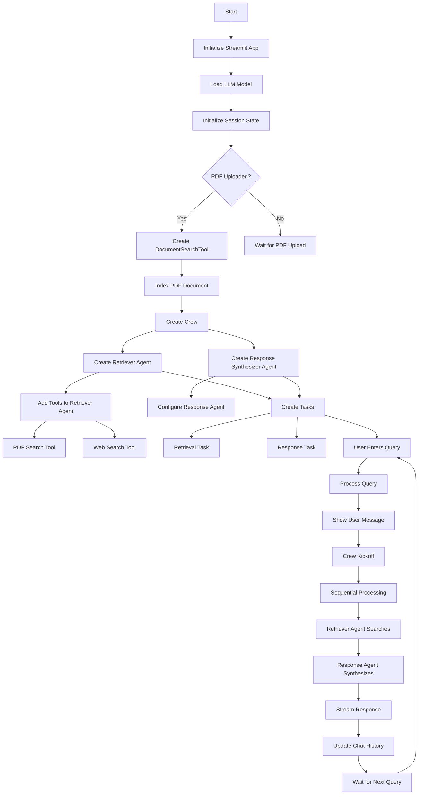

# 🤖 Agentic RAG using CrewAI

<div align="center">


A powerful Retrieval-Augmented Generation (RAG) system built with CrewAI that intelligently searches through documents and falls back to web search when needed. Features local LLM support with deep-seek-r1 or llama 3.2!

</div>

## 🌟 Features

- 📚 Document-based search with RAG capabilities
- 🌐 Automatic fallback to web search
- 🤖 Local LLM support (deep-seek-r1 or llama 3.2)
- 🔄 Seamless integration with CrewAI
- 💨 Fast and efficient document processing
- 🎯 Precise answer synthesis

## 🔄 System Flow

Below is the detailed flow diagram of how the system processes queries and generates responses:



## 🚀 Prerequisites

Before running the application, ensure you have:

1. **API Keys**:
   - FireCrawl API or SEPER API key for web search capabilities
   - LLM API key (if required for your chosen model)

2. **Python Environment**:
   - Python 3.11 or later
   - Conda (recommended for environment management)

## 💻 Installation

1. **Create and Activate Environment**:
   ```bash
   conda create -n env_crewai python==3.12 -y
   conda activate env_crewai
   ```

2. **Install Dependencies**:
   ```bash
   # Install package management tools
   uv lock
   uv sync

   # Install required packages
   pip install crewai crewai-tools markitdown qdrant-client fastembed
   ```

## 🎮 Running the Application

Choose your preferred LLM model:

- **For deep-seek-r1**:
  ```bash
  streamlit run app_deep_seek.py
  ```

- **For llama 3.2**:
  ```bash
  streamlit run app_llama3.2.py
  ```

## 🛠️ System Architecture

The system consists of two main agents:

1. **Retriever Agent**:
   - Handles document searching
   - Manages web search fallback
   - Uses both PDF and web search tools

2. **Response Synthesizer Agent**:
   - Processes retrieved information
   - Generates coherent responses
   - Ensures context relevance

## 📚 Usage Examples

1. **Document Search**:
   - Upload your PDF document
   - Enter your query
   - Receive contextual answers from the document

2. **Web Search Fallback**:
   - System automatically detects when document search isn't sufficient
   - Seamlessly switches to web search
   - Combines information from multiple sources

## 🤝 Contributing

Contributions are welcome! Please feel free to submit a Pull Request.

1. Fork the repository
2. Create your feature branch (`git checkout -b feature/AmazingFeature`)
3. Commit your changes (`git commit -m 'Add some AmazingFeature'`)
4. Push to the branch (`git push origin feature/AmazingFeature`)
5. Open a Pull Request

## 📝 License

This project is licensed under the MIT License - see the [LICENSE](LICENSE) file for details.

## 🙏 Acknowledgments

- [CrewAI](https://github.com/joaomdmoura/crewai) for the amazing framework
- The open-source community for various tools and libraries used in this project

---

<div align="center">
Made with ❤️ by [KNA]
</div>

