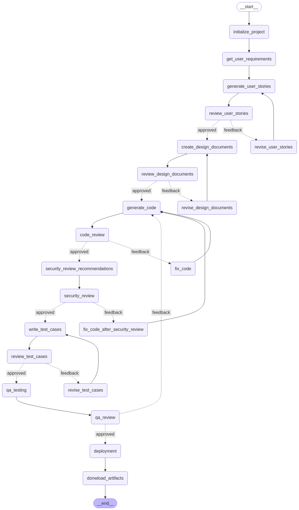

# DevPilot

## _Pilot your entire software lifecycle from idea to release_

## Overview
DevPilot is an end-to-end solution designed to automate your entire software development lifecycle. This project leverages a modular, graph-based architecture to transform user requirements into a fully deployed solution. It handles everything from collecting user requirements and generating user stories to creating design documents, code generation, security and test reviews, and deployment. In addition, Markdown artifacts for each phase are automatically generated and made available for download.

DevPilot uses a state-driven graph (powered by [LangGraph](https://www.langchain.com/langgraph)) with conditional routing to manage the process. The project also integrates with Redis (optionally hosted externally) for caching and state persistence, and provides a visual workflow diagram of the entire process.

## Features
- **End-to-End SDLC Automation:** Automates every stage of the software development lifecycle—from project initialization to deployment.
- **Graph-Based Orchestration:** Uses a state-driven graph with conditional routing to manage SDLC tasks.
- **Artifact Generation:** Automatically generates Markdown documentation for:
  - Project Requirements
  - User Stories
  - Design Documents (Functional & Technical)
  - Generated Code
  - Security Recommendations
  - Test Cases
  - QA Testing Comments
  - Deployment Feedback
- **Interactive Review & Feedback:** Dynamic review cycles at multiple stages with options to approve or provide feedback with Humman-in-the-Loop.

## Project Structure
```plaintext
DevPilot/
├── artifacts/              # Generated Markdown artifact files
├── src/
│   └── dev_pilot/
│       ├── cache/          # Redis cache and state persistence
│       ├── api/            # Fast API integration logic
│       ├── graph/          # Graph builder and related logic
│       ├── LLMS/           # LLM integrations (Gemini, Groq, OpenAI, etc.)
│       ├── nodes/          # Individual nodes handling each SDLC phase (requirements, coding, etc.)
│       ├── state/          # SDLC state definitions and data models
│       ├── ui/             # UI components (e.g., Streamlit front-end, if any)
│       ├── utils/          # Utility functions or classes (formatting, helpers, etc.)
├── app.py                  # Main entry script (e.g., Streamlit or other CLI)
├── LICENSE
├── README.md
├── requirements.txt        # Python dependencies
├── workflow_graph.png      
├── .env                    # Environment variables (API keys, etc.)
└── .gitignore
```

## Setup Instruction
There are 2 entry point in the application: 1. FastAPI 2. Streamlit UI. Depending on the input passed through the command line, the application will be launched in the respective mode.
- Clone the repo
- Create a virtual environment
- Install the requirements
- Install Docker Desktop
- Pull the Redis image using `docker pull redis`
- Run the Redis container using `docker run -p 6379:6379 redis` (Docker is used to store the state of the graph in Redis)
- Run the streamlit app using `streamlit run app_streamlit.py`
- Run the FastAPI app using `python app_api.py`

Make sure to setup the environment variables in the .env file before running the application for the respective LLMs key.

If you don't want to use the redis locally through docker then flow below steps:
- Inside `src/dev_pilot/cache/redis_cache.py` comment the docker redis client and uncomment the upstash redis client.
- Set the url and token in the .env file.

## FastAPI Endpoints

### 1. Start SDLC Process

Start the SDLC process by providing the project name. This endpoint initializes the SDLC process and returns a task ID.

**Request:**
```http
POST /api/v1/sdlc/start
Content-Type: application/json

{
    "project_name": "Ecommerce Platform"
}
``` 

**Response:**
```json
{
    "status": "success",
    "message": "SDLC process started successfully",
    "task_id": "sdlc-session-f0b4d555",
    "state": {
        "project_name": "Ecommerce Platform"
    },
    "error": null
}
```

### 2. Generate User Stories

Generate user stories based on the provided project name and requirements. Return the generated user stories and the next node to proceed to.

**Request:**
```http
POST /api/v1/sdlc/user_stories
Content-Type: application/json

{
    "project_name": "Ecommerce Platform",
    "requirements": [
        "Users can browser the products",
        "Users should be able to add the product in the cart",
        "Users should be able to do the payment",
        "Users should be able to see their order history"
    ],
    "task_id": "sdlc-session-f0b4d555" // Unique task_id for a particular SDLC process
}
```

**Response:**
```json
{
    "status": "success",
    "message": "User Stories generated successfully",
    "task_id": "sdlc-session-f0b4d555",
    "state": {
        "next_node": "review_user_stories",
        "project_name": "Ecommerce Platform",
        "requirements": [
            "Users can browser the products",
            "Users should be able to add the product in the cart",
            "Users should be able to do the payment",
            "Users should be able to see their order history"
        ],
        "user_stories": {
            "user_stories": [
                {
                    "id": 1,
                    "title": "Browse Products",
                    "description": "As a guest user, I want to browse the products so that I can explore available items.",
                    "priority": 2,
                    "acceptance_criteria": "Verify that products are displayed with relevant details such as name, price, and image.\nVerify that users can filter products based on categories.\nVerify that users can sort products based on price, popularity, and rating."
                },
                {
                    "id": 2,
                    "title": "Add Product to Cart",
                    "description": "As a registered user, I want to add products to the cart so that I can purchase them later.",
                    "priority": 1,
                    "acceptance_criteria": "Verify that users can add products to the cart from the product details page.\nVerify that the cart updates in real-time when a product is added.\nVerify that users can view the cart with the selected products and quantities."
                },
                {
                    "id": 3,
                    "title": "Process Payment",
                    "description": "As a customer, I want to do the payment so that I can complete my purchase.",
                    "priority": 1,
                    "acceptance_criteria": "Verify that users can complete the payment process using valid credit/debit cards.\nVerify that the payment process is secure and compliant with industry standards.\nVerify that users receive an order confirmation upon successful payment."
                },
                {
                    "id": 4,
                    "title": "View Order History",
                    "description": "As a registered user, I want to see my order history so that I can track my past purchases.",
                    "priority": 3,
                    "acceptance_criteria": "Verify that users can view their order history with details such as order date, products, and status.\nVerify that users can filter their order history by date or order status.\nVerify that users can view the details of each order."
                }
            ]
        }
    },
    "error": null
}
```

### 3. Update Workflow Progress

Update the SDLC workflow progress (e.g., moving to the review phase) by providing the next node, status, and feedback. This endpoint updates the workflow state and returns the updated state along with the next node to proceed to. This contains the humman in the loop feedback.

**Request:**
```http
POST /api/v1/sdlc/progress_flow
Content-Type: application/json

{
    "project_name": "Ecommerce Platform",
    "task_id": "sdlc-session-f0b4d555",
    "next_node": "review_user_stories", // next node to proceed to, each iteration will return the next node to proceed to
    "status": "approved", // approved or feedback
    "feedback": "None" // if status is feedback then provide the input
}
```
**Response:**
```json
{
  "status": "success",
  "message": "Flow progressed successfully to next step",
  "task_id": "sdlc-session-9884697b",
  "state": {
    "next_node": "review_design_documents",
    "project_name": "Ecommerce Platform",
    "requirements": [
      "Users can browser the products",
      "Users should be able to add the product in the cart",
      "Users should be able to do the payment",
      "Users should be able to see their order history"
    ],
    "user_stories": {
      "user_stories": [
        {
          "id": 1,
          "title": "Browse Products",
          "description": "As a guest user, I want to browse the products so that I can explore available items.",
          "priority": 2,
          "acceptance_criteria": "Verify that products are displayed with relevant details such as name, price, and image.\nVerify that users can filter products based on categories.\nVerify that users can sort products based on price, popularity, and rating."
        },
        {
          "id": 2,
          "title": "Add Product to Cart",
          "description": "As a registered user, I want to add products to the cart so that I can purchase them later.",
          "priority": 1,
          "acceptance_criteria": "Verify that users can add products to the cart from the product details page.\nVerify that the cart updates in real-time when a product is added.\nVerify that users can view the cart with the selected products and quantities."
        },
        {
          "id": 3,
          "title": "Process Payment",
          "description": "As a customer, I want to do the payment so that I can complete my purchase.",
          "priority": 1,
          "acceptance_criteria": "Verify that users can complete the payment process using valid credit/debit cards.\nVerify that the payment process is secure and compliant with industry standards.\nVerify that users receive an order confirmation upon successful payment."
        },
        {
          "id": 4,
          "title": "View Order History",
          "description": "As a registered user, I want to see my order history so that I can track my past purchases.",
          "priority": 3,
          "acceptance_criteria": "Verify that users can view their order history with details such as order date, products, and status.\nVerify that users can filter their order history by date or order status.\nVerify that users can view the details of each order."
        }
      ]
    },
    "user_stories_feedback": "None",
    "user_stories_review_status": "approved",
    "design_documents": {
      "functional": "```markdown\n# Functional Design Document: Ecommerce Platform\n\n## 1. Introduction and Purpose\n\nThis document outlines the functional design of a new e-commerce platform. The purpose of this platform is to provide a user-friendly and efficient online shopping experience for customers, while also providing a robust and manageable backend for administrators to manage products, orders, and customer data. This document serves as a blueprint for the development team, ensuring a shared understanding of the platform's intended functionality.\n\n## 2. Project Scope\n\nThis project encompasses the development of a fully functional e-commerce platform, including:\n\n*   **Product Catalog:**  Displaying and managing product information.\n*   **Shopping Cart:**  Allowing users to add, modify, and review items before purchase.\n*   **Checkout Process:**  Handling shipping information, payment processing, and order confirmation.\n*   **User Account Management:**  Providing user registration, login, and profile management.\n*   **Order Management:**  Tracking order status and history.\n*   **Payment Gateway Integration:**  Securely processing online payments.\n\nThis project excludes:\n\n*```",
      "technical": "```markdown\n# Technical Design Document: Ecommerce Platform\n\n## 1. System Architecture\n\nThe Ecommerce Platform will adopt a microservices architecture. This approach promotes modularity, scalability, and independent deployments.\n\n**Components:**\n\n*   **Frontend Service:** User interface, handles user interactions (browsing, cart management, checkout).\n*   **Product Catalog Service:** Manages product information (name, description, price, inventory).\n*   **Cart Service:** Manages user shopping carts.\n*   **Order Service:** Processes orders, manages order history.\n*   **Payment Service:** Handles payment processing.\n*   **User Service:** Manages user accounts and authentication.\n*   **Notification Service:** Sends email and other notifications (order confirmation, shipping updates).\n*   ```"
    }
  },
  "error": null
}
```

### How to Use
- **Start the Process:**  
  Send the "start" request to initialize the SDLC process, which returns a task ID and state.
  
- **Generate User Stories:**  
  Use the task ID from the start process, along with the project requirements, to generate user stories.
  
- **Update Workflow Progress:**  
  With the task ID, update the workflow (for example, by approving or giving feedback on user stories). With each iteration pass the next node to proceed to and the status of the previous node. Status can be approved or feedback. Based on the status the next node will be determined. Once the workflow is completed it will return the end node, which indicates the completion of the SDLC process.

- **Added Postman collection for reference.**

## Workflow Graph


## Workflow Video
[Watch the video](https://youtu.be/SfYjKJzl1I8)