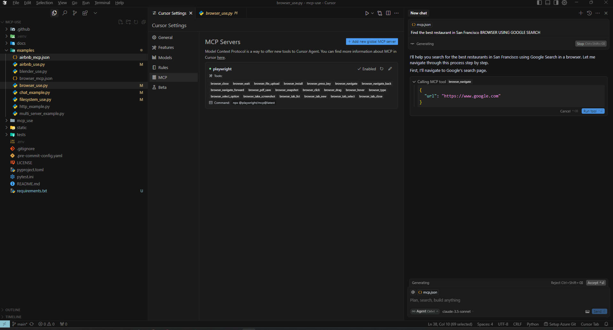
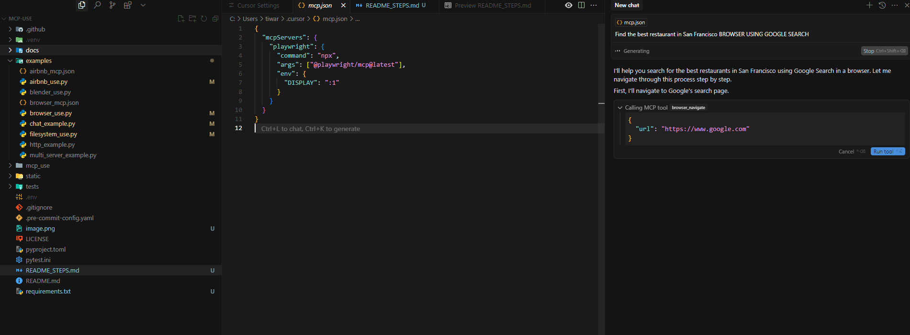
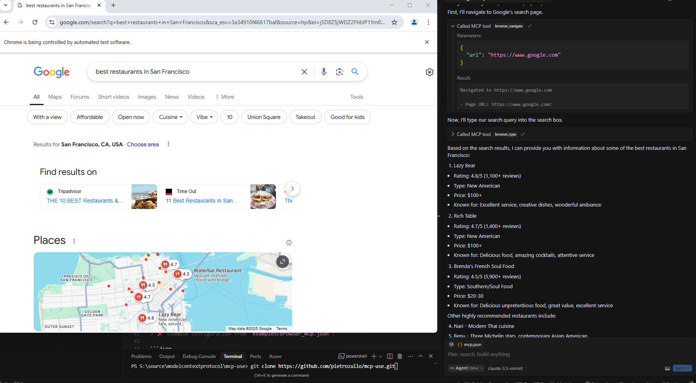

# MCP-USE Setup Guide

This guide will help you set up and configure the [mcp-use](https://github.com/pietrozullo/mcp-use) repository for use with **Groq** and **Cursor**.

---

## 🔧 Setup Instructions

### 1. Clone the Repository  
Use the following command to clone the repo:

```bash
git clone https://github.com/mcp-use/mcp-use.git
```

---

### 2. Create a Virtual Environment  
Set up a Python virtual environment in your project directory:

```bash
python -m venv venv
source venv/bin/activate  # On Windows use: venv\Scripts\activate
```

---

### 3. Switched from OpenAI to Groq  
To support Groq, a few edits have been made in the codebase replacing OpenAI-specific usage with Groq for added flexibility.

---

### 4. Locate the Example Config File  
Inside the `examples` folder, you'll find various configuration files. Choose the appropriate one based on your use case.

---

### 5. Add Config to Cursor Settings  
Take the selected config (e.g., `examples/browser_mcp.json`) and paste its content into **Cursor's MCP Settings**.

> 📌 Example configuration from `examples/browser_mcp.json`:

```json
{
  "mcpServers": {
    "playwright": {
      "command": "npx",
      "args": ["@playwright/mcp@latest"],
      "env": {
        "DISPLAY": ":1"
      }
    }
  }
}
```

Paste this in Cursor settings under the MCP section:



Example:



OUTPUT :

---