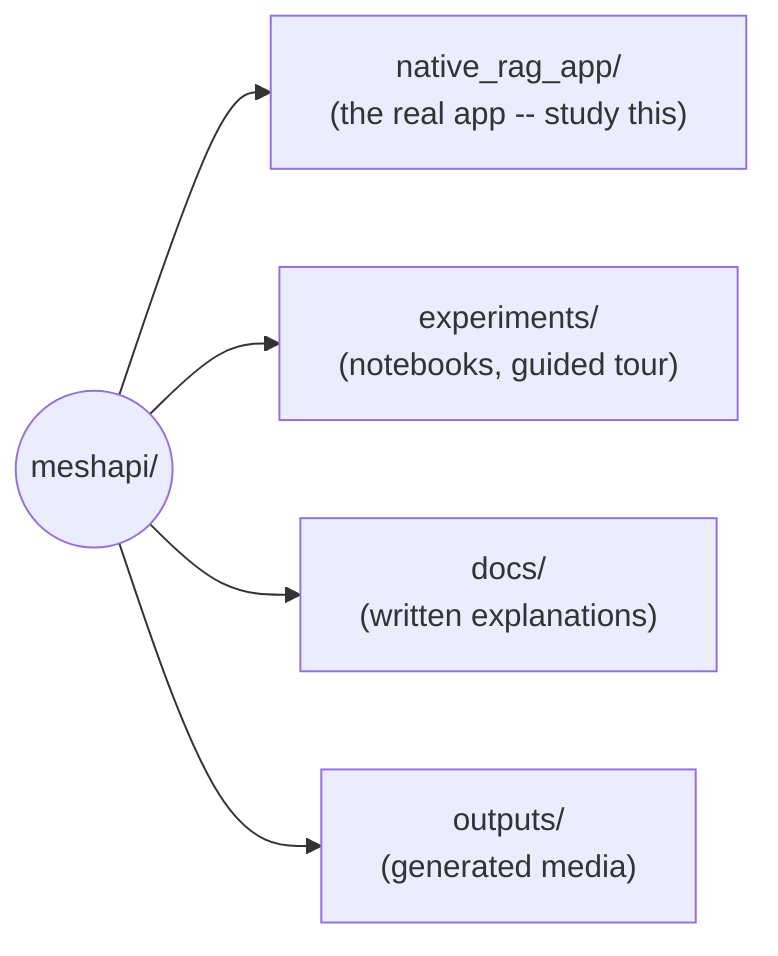
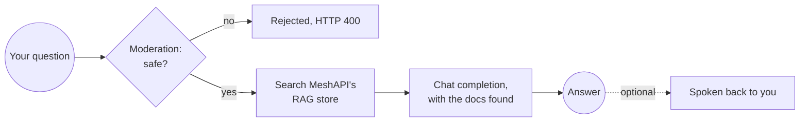

EXPLORE MESHAPI NOW VIA THIS LINK TO GET FREE CREDITSSS YAYYY !!! :

https://link.meshapi.ai/krishnaik

# Welcome to the MeshAPI Implementation Repository

Welcome! This repository is a hands-on tour of MeshAPI an
AI model gateway that gives you **one API key and one OpenAI-shaped API** in front of many LLM
providers (OpenAI, Mistral, and more), plus embeddings, a managed RAG file store, moderation,
speech-to-text, and text-to-speech.

The goal here is simple: **learn how MeshAPI actually works, step by step**, by reading real,
runnable code -- not just docs. Everything in this repo was built and verified against a live API
key.

📺 **[Learn MeshAPI on my YouTube — MeshAPI Crash Course](https://www.youtube.com/watch?v=LsWr1ehbLOE&t=4564s)**

---

## What's in this repo

```
meshapi/
  native_rag_app/    A complete RAG app built entirely on MeshAPI (this is the main thing to study)
  experiments/       Jupyter notebooks -- the guided feature tour
  docs/              Ordered, plain-language documentation (read docs/README.md first)
  outputs/           Generated media (images, speech, video) produced by the notebooks
  requirements.txt   Python dependencies
  .env.example       Template for your environment variables
```

*(An earlier Pinecone-based version of this RAG app, `app/`, plus its own root-level
`static/`/`templates/`, has been removed -- `native_rag_app/` replaced it entirely.)*



### `native_rag_app/` -- the star of the repo


A full **Retrieval-Augmented Generation (RAG)** app where *every* piece of intelligence comes from
MeshAPI -- no separate vector database, no separate embeddings service, no separate speech service.
One key does it all. It also has **voice**: you can speak your question and hear the answer read
back.

```
native_rag_app/
  config.py          Settings loaded from environment variables
  data.py            The sample knowledge base (plain text -- MeshAPI chunks it server-side)
  meshapi_client.py  Thin wrapper around the MeshAPI SDK: chat, moderation, RAG upload/search, STT, TTS
  rag.py             The RAG orchestration: ingest / retrieve / answer
  schemas.py         Request/response models
  main.py            FastAPI routes, including the voice endpoint
  templates/index.html   Single-page UI: type or speak a question, hear the answer back
  static/app.js      Mic recording (MediaRecorder) + fetch calls to the JSON API
  static/style.css
```

### `experiments/` -- the notebooks

The notebooks you actually run live directly in `experiments/`; the original, pre-simplification
versions of `01` and `02` are kept in **`experiments/old_experiments/`** for reference (not deleted,
just out of the way). The recommended teaching order is **01 -> 02 -> features**, each one building
on exactly what the last one taught, with no topic repeated twice:

- **`01_meshapi_basics_lazy_imports.ipynb`** -- the bare minimum: open a client, one chat completion,
  check what it cost, close the client. That's it -- streaming, `compare`, model discovery, and
  everything else used to live here too (see `old_experiments/01_meshapi_basics.ipynb`), but now live
  only in `features_lazy_imports.ipynb` so they're taught exactly once.
- **`02_rag_multiagent_lazy_imports.ipynb`** -- a RAG + multi-agent capstone (Researcher -> Writer ->
  Critic), each agent routed through a different provider via MeshAPI. Picks up right after `01`'s
  bare-minimum client, and introduces model discovery, embeddings, Pinecone, and LangChain's
  `create_agent` itself, in small steps -- split into smaller single-purpose cells than the original
  in `old_experiments/02_rag_multiagent.ipynb` for a smoother live-coding pace.
- **`features_lazy_imports.ipynb`** -- the full feature tour: everything `01`
  used to cover (streaming, `compare`, model discovery, error handling) plus tool calling, structured
  outputs, the Responses API, Auto Router, and every other MeshAPI capability (RAG, memory, images,
  video, audio, moderation, caching, batch, templates, web search, accounts, dev tooling). *(The
  original `features.ipynb` this was copied from didn't survive an earlier repo reorg -- it's absent
  from disk, though still recoverable from git history if needed. `features_lazy_imports.ipynb` is
  the complete, current version.)*

### `docs/` -- the written guides

Start with **[`docs/README.md`](docs/README.md)**, which orders everything. In short:
`01_research.md` (feature inventory) -> `02_features.md` (notebook walkthrough) ->
`03_cli_and_claude_code.md` + `04_mcp_capabilities.md` + `05_meshapi_vs_claude_code.md` (tooling and
comparisons) -> `06_native_rag_app.md` (the app itself).

---

## How MeshAPI works, step by step

The whole point of MeshAPI is that these steps all run through **one client, one key**. Here's the
flow the native RAG app follows:



1. **Create one client.** You construct a single `MeshAPI(base_url=..., token=...)` client. Every
   capability below hangs off it -- no per-service SDKs or keys.

2. **Upload documents to the managed RAG store.** Instead of chunking and embedding yourself, you
   hand raw files to `client.rag.upload_file(..., embed=True)`. MeshAPI chunks, embeds, and stores
   them server-side, and hands back a `file_id`. (See `meshapi_client.upload_document`.)

3. **Wait for embedding to finish.** Uploads embed asynchronously; you poll
   `client.rag.get(file_id).embedding_status` until it's `ready`. (See `rag.ingest`.)

4. **Search / retrieve.** For a user question, `client.rag.search(SearchRequest(query, top_k,
   file_ids=...))` returns the most relevant chunks. We pass our own `file_ids` to scope the search
   (see the gotcha below). (See `meshapi_client.search`.)

5. **Moderate the input.** Before answering, `client.moderations.create(...)` flags unsafe
   questions so we can reject them. (See `meshapi_client.is_flagged`.)

6. **Generate the answer.** We stuff the retrieved chunks into a prompt and call
   `client.chat.completions.create(...)` -- the familiar OpenAI-shaped chat API, but the `model`
   string (`provider/model`) picks *which provider* answers. (See `meshapi_client.ask` and
   `rag.answer`.)

7. **Speech in and out (optional).**
   - **Speech-to-text:** `client.audio.transcribe(...)` turns a recorded question into text.
   - **Text-to-speech:** `client.audio.synthesize(...)` turns the answer into audio.
   (See `meshapi_client.transcribe` / `meshapi_client.synthesize_base64`.)

**One real gotcha:** MeshAPI's `/v1/files` store is **account-wide** -- every file ever uploaded
with your key lands in the same searchable pool, and there's no delete endpoint. So the app records
the `file_id`s from its own `ingest()` in a small local `.rag_state.json` and always passes them to
`search(..., file_ids=...)`, keeping results scoped to just its own data.

---

## Setup

### 1. Prerequisites
- Python 3.10+ (the app uses `str | None` union syntax)
- A **MeshAPI API key** from the [MeshAPI dashboard](https://developers.meshapi.ai) -> API Keys.
  This single key powers chat, embeddings, RAG, moderation, STT, and TTS -- nothing else needed.

### 2. Create a virtual environment and install dependencies

```bash
python -m venv .venv
.venv\Scripts\activate      # Windows
# source .venv/bin/activate # macOS / Linux
pip install -r requirements.txt
```

### 3. Configure your environment

```bash
copy .env.example .env      # Windows  (cp .env.example .env on macOS/Linux)
```

Then edit `.env` and set your key:

```
MESH_API_KEY=rsk_your_meshapi_key_here
MESHAPI_BASE_URL=https://api.meshapi.ai
MESHAPI_CHAT_MODEL=openai/gpt-4o-mini      # any provider/model MeshAPI routes to
RAG_TOP_K=3
# Voice (optional overrides)
MESHAPI_TTS_MODEL=hexgrad/kokoro-82m
MESHAPI_TTS_VOICE=af_heart
MESHAPI_STT_MODEL=elevenlabs/scribe_v1
```

No Pinecone or vector-database variables needed at all -- retrieval runs entirely through MeshAPI's
managed RAG store.

---

## Running the native RAG app

```bash
uvicorn native_rag_app.main:app --reload
```

Open **http://127.0.0.1:8000**, click **"Index knowledge base"** once to upload and embed the
sample docs, then type a question or click the mic and ask out loud.

### Or use the JSON API directly

```bash
# Upload + embed the sample knowledge base (do this once)
curl -X POST http://127.0.0.1:8000/api/ingest

# Ask a question (add "speak": true to also get audio back)
curl -X POST http://127.0.0.1:8000/api/ask \
  -H "Content-Type: application/json" \
  -d '{"question": "What happens if I go over my storage limit?", "speak": true}'
```

`speak: true` (and every `/api/ask-voice` call) returns a base64-encoded audio clip in
`audio_base64` alongside the text answer.

---

## Where to go next

- Read **[`docs/README.md`](docs/README.md)** for the full documentation index.
- Open the notebooks in **`experiments/`** to see each MeshAPI feature run live.
- Study **`native_rag_app/`** to see how a real, complete app is wired together end to end.
