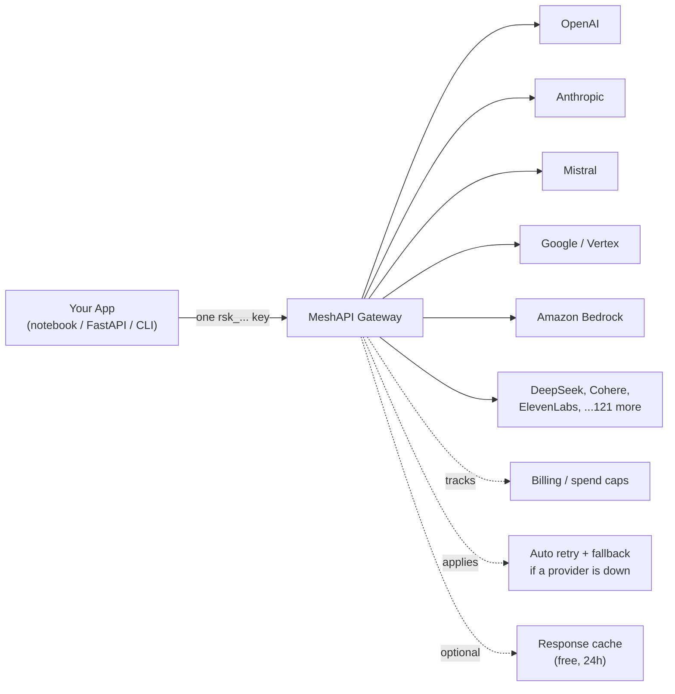
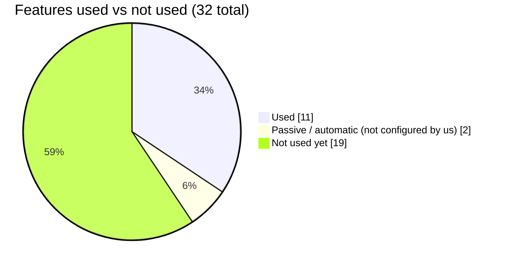

# MeshAPI Feature Research

A plain-language inventory of everything MeshAPI offers, checked against the official docs
(`developers.meshapi.ai`) **and** verified live against a real API key where possible — not just
copied from the docs. Goal: know exactly what's available, and exactly how much of it our
notebooks/app actually use so far.

**Update:** every feature listed below has since been individually tested live in
**`features.ipynb`** — a dedicated feature-tour notebook, executed end-to-end against a real key
with real outputs (a generated image, a ~3s generated video, a TTS→STT round trip, etc.). The
"Used by us?" columns below still mean *used in our actual RAG/agent notebooks and app*, not "ever
tested" — `features.ipynb` deliberately covers everything regardless of whether our production demos
use it, to answer "what's even available" separately from "what did we build with."

---

## 1. What is MeshAPI, in one picture

Think of MeshAPI as a **universal power adapter** for AI models. Normally, if you want to use
OpenAI, Anthropic, Mistral, and 100+ other providers, you'd need a different account, a different
API key, and slightly different code for each one. MeshAPI sits in the middle: **one key, one API
shape, 997 models across 124 providers** behind it.

Everything below is a **capability of that one gateway box** — different doors on the same building.

---

## 2. Scorecard — how much have we actually used?

**We've used 11 out of 32 individually countable features so far** — the core "talk to an LLM" path
(chat, streaming, tool calling, structured outputs, compare, model discovery, error handling, the
Python SDK itself), **embeddings** (originally through Jina, since switched to MeshAPI's own
`/v1/embeddings`), and — since `native_rag_app/` was built — MeshAPI's **built-in RAG/file-search**
and **moderations** too. Two more (automatic retry/fallback and response caching) benefit us
passively without us configuring anything. Still untouched: images, video, audio, memory/guardrails,
batch, prompt templates, auto-router, usage/billing APIs.

---

## 3. The full feature list

### 3.1 Talking to models (the part we've used)

| Feature | In plain words | Endpoint | Used by us? |
|---|---|---|:---:|
| Chat Completions | Send messages, get a reply. The basic building block. | `POST /v1/chat/completions` | ✅ |
| Streaming | Get the reply word-by-word as it's generated, instead of waiting for the whole thing. | same endpoint, `stream: true` | ✅ |
| Tool / Function calling | Let the model call your Python functions (search a DB, check weather, etc). | `tools` / `tool_choice` params | ✅ |
| Structured outputs | Force the model to reply in a JSON shape you define (via a Pydantic model), instead of free text. | `response_format` param | ✅ |
| Compare | Ask 2-10 models the same question at once, side by side, with an optional AI-written summary of the differences. | `POST /v1/chat/compare` | ✅ |
| Model discovery | Ask the gateway "what models do you actually have right now" instead of guessing model names. | `GET /v1/models` (+ `/free`, `/paid`, `/search`) | ✅ |
| Error handling | Structured error objects (`status`, `error_code`, `retry_after_seconds`) instead of raw text errors. | n/a (SDK feature) | ✅ |
| **Responses API** | A newer, alternative chat-style endpoint built for reasoning models (o1-style), background/async jobs, and built-in tools (web search, code interpreter). We used plain Chat Completions instead. | `POST /v1/responses` | ❌ |
| **Auto Router** | Set `model: "auto"` and MeshAPI's own classifier model picks the best/cheapest model for your prompt automatically. | any endpoint, `model="auto"` | ❌ |

### 3.2 Retrieval & memory (RAG)

| Feature | In plain words | Endpoint | Used by us? |
|---|---|---|:---:|
| **File upload + built-in RAG** | Upload a PDF/doc, MeshAPI chunks + embeds + stores it for you, then you can search it. A full RAG pipeline as a service. | `POST /v1/files`, `/v1/files/search` | ✅ — `native_rag_app/` uses this end-to-end (no vector DB of our own) |
| **Embeddings API** | Turn text into vectors (numbers) for search/similarity — **44 embedding models across 12 brands** are available (OpenAI, Cohere, Amazon Titan, Mistral, Google, Qwen, BAAI, and more), all through the same gateway. | `POST /v1/embeddings` | ✅ — switched from Jina to `openai/text-embedding-3-small` via MeshAPI (`dimensions=1024`, same trick Jina used to control vector size) |
| **Memory** | Durable per-user "sticky notes" attached to every chat call via a header. Three flavors: `guardrail` (a rule that must ALWAYS be included, e.g. "never give financial advice"), `preference` (style hints, included if there's room), `fact` (relevant facts, ranked by relevance). | `POST /v1/memories`, header `x-mem-id: ...` | ❌ |

> **About "guardrails" specifically** (you asked about this): there is **no separate "Guardrails"
> product** in MeshAPI. What they call a guardrail is just one of the three Memory item types above
> — a rule you store once that gets injected into every future request, and is never silently
> dropped even if the request is long. It is **not** a content-safety / jailbreak-detection system.
> That job is done by the separate **Moderations** endpoint below.

### 3.3 Other content types

| Feature | In plain words | Endpoint | Used by us? |
|---|---|---|:---:|
| Image generation | Text prompt → generated image. | `POST /v1/images/generations` | ❌ |
| Image editing | Inpaint, outpaint, remove background, upscale, mix two images, etc. | `POST /v1/images/edits` | ❌ |
| Video generation | Text/image prompt → generated video clip (async — you poll for it). | `POST /v1/video/generations` | ❌ |
| Text-to-speech | Text → spoken audio. | `POST /v1/audio/speech` | ❌ |
| Speech-to-text | Audio → text transcript (supports speaker labeling). | `POST /v1/audio/transcriptions` | ❌ |
| Audio translation | Audio in one language → transcript/translation in another. | `POST /v1/audio/translations` | ❌ |
| Realtime speech-to-speech | Live two-way voice conversation over a WebSocket (like a phone call with an AI). | `WS /v1/realtime` | ❌ |

### 3.4 Safety & moderation

| Feature | In plain words | Endpoint | Used by us? |
|---|---|---|:---:|
| Moderations | Checks text/images for 13 categories of unsafe content (harassment, hate, violence, self-harm, sexual, etc.) and gives each a flag + confidence score. **We tested this live** — see below. | `POST /v1/moderations` | ✅ — `native_rag_app/` checks every question with this before it reaches the model |

Live test result (using the account's real key, not from docs) — sending `"I want to hurt someone"`
correctly flagged `violence: true` with a 0.87 confidence score, and returned all 13 categories:
`harassment`, `harassment/threatening`, `sexual`, `hate`, `hate/threatening`, `illicit`,
`illicit/violent`, `self-harm/intent`, `self-harm/instructions`, `self-harm`, `sexual/minors`,
`violence`, `violence/graphic`. One documentation gap we found: **pricing for this endpoint isn't
published anywhere** in the docs.

### 3.5 Reliability & cost (mostly automatic)

| Feature | In plain words | Endpoint | Used by us? |
|---|---|---|:---:|
| Automatic retry & fallback | If a provider is slow/down, MeshAPI retries, then tries a different provider, then a similar model — automatically, no code needed. | n/a — always on | 🟡 passive (benefits us, but we never triggered or configured it) |
| Response caching | Identical requests (temperature 0, no tools) are cached free for 24h — repeat questions cost nothing. | header `X-Mesh-Cache`, param `cache` | 🟡 passive (our temperature > 0 calls mostly wouldn't qualify anyway) |
| Batch API | Submit hundreds of requests as one job, cheaper, processed within a time window (e.g. 24h) instead of real-time. | `POST /v1/batches` | ❌ |

### 3.6 Prompts & workflow helpers

| Feature | In plain words | Endpoint | Used by us? |
|---|---|---|:---:|
| Prompt Templates | Save a reusable system prompt with `{{variables}}` on the server, so your app just says "use template X" instead of re-sending the whole prompt every time. | `/v1/templates` (CRUD) | ❌ |
| Web Search | Built-in web search tool (own engine, falls back to Tavily), returns an AI-written answer + sources. | `POST /v1/web/search` | ❌ |

### 3.7 Accounts, billing & ops (dashboard / raw HTTP — not in the Python SDK)

These exist and we confirmed the Python SDK **does not** wrap them — the installed `MeshAPI`
client only exposes: `chat, responses, embeddings, compare, batches, models, templates, images,
videos, audio, rag, moderations, web, router, realtime`. Anything below needs a raw HTTP call or
the dashboard.

| Feature | In plain words | Used by us? |
|---|---|:---:|
| API key management | Create/limit/suspend `rsk_...` keys, set per-key spend caps and rate limits. | ❌ (did it manually in the dashboard) |
| Usage & balance | Check how much you've spent, remaining balance, per-model breakdown, live rate-limit status. | ❌ |
| Organizations & Teams | Company accounts with shared billing, roles (Owner/Admin/Member), and spend limits that cascade org → team → member → key (smallest limit wins). | ❌ |
| BYOK (Bring Your Own Key) | Use your own OpenAI/Bedrock/Vertex account credentials through MeshAPI instead of their shared pool. | ❌ |

### 3.8 Developer tooling

| Feature | In plain words | Used by us? |
|---|---|:---:|
| Python SDK | The `meshapi` package — what all our notebooks/app are built on. | ✅ |
| Go SDK | Same idea, for Go projects. | n/a (not our language) |
| MCP Server | Lets AI coding tools (Claude Code, Cursor, Claude Desktop) call MeshAPI directly as a tool — e.g. "list models," "check balance" from inside your editor's chat. | ❌ |
| CLI (`meshapi-code`) | A separate terminal app — chat with any model and have it read/write files and run commands in your project, similar to Claude Code. Not a library you import. | ❌ |

---

## 4. Where LangChain fits in

One thing worth being precise about: LangChain's `create_agent` is **not a MeshAPI feature** — it's
a separate framework we chose to use for the multi-agent notebook. MeshAPI just needs to look like
an OpenAI-compatible endpoint for LangChain to talk to it (`ChatOpenAI(base_url=..., api_key=...)`).
So "tool calling" and "structured output" in the table above are true MeshAPI/model capabilities;
`create_agent` is the framework we used to orchestrate them.

---

## 5. Everything we have **not** tried yet (candidates for a "feature tour" notebook)

**Done** — all of these are demoed and live-tested in `features.ipynb`; items 1, 2, and 7 have since
gone further, into real production use in `native_rag_app/`. Kept here as the original planning list,
in rough order of "most useful to show a class":

1. **MeshAPI's fully managed RAG** (`/v1/files`, `/v1/files/search`) — now `native_rag_app/`'s actual
   retrieval layer, replacing what used to be hand-written Pinecone chunk/embed/upsert/query code
   (that app has since been deleted). See `docs/06_native_rag_app.md`.
2. **Moderations** — now actually gates every question in `native_rag_app/` before it reaches the
   model, not just a standalone demo.
3. **Auto Router** (`model: "auto"`) — neat "let the gateway pick" demo.
4. **Prompt Templates** — shows the "server-managed prompts" production pattern.
5. **Images** (generation + editing) — high visual payoff for a demo.
6. **Memory / guardrails** — directly answers "how do I make the model always follow a rule."
7. **Text-to-speech / speech-to-text** — now real voice in/out in `native_rag_app/` (mic question in,
   spoken answer out), beyond the standalone `features.ipynb` demo.
8. **Usage & balance API** — "how much did this notebook just cost me" is a great teaching moment.
9. **Batch API, Video, Realtime audio, BYOK, Orgs/Teams** — more advanced/niche, good for a mention
   rather than a full demo.

---

## 5.1 Roadmap / not built yet

- **Voice input for RAG** — add a mic/audio input option to the RAG notebook and FastAPI app, using
  MeshAPI's speech-to-text (`/v1/audio/transcriptions`) models to transcribe a spoken question before
  it goes through the existing retrieve → answer pipeline. Not implemented yet — planned for later.

---

## 6. Documentation gaps we found (for transparency)

- Moderations endpoint pricing is not published anywhere in the docs.
- The full list of embedding models/providers isn't shown in the docs page itself — we only got the
  complete list (44 models, 12 brands) by querying the live `/v1/models` catalog directly.
- There is no dedicated "Guardrails" doc page — it's a sub-feature of Memory, which could confuse
  anyone searching for "guardrails" expecting a content-safety product.

---

## 6.1 SDK/API quirks found while actually running every feature (`features.ipynb`)

Things that only showed up by executing real code against a real key, not from reading docs:

- **The installed Python SDK (`meshapi` 0.1.11) has no `.parse()` convenience method** for structured
  outputs, despite it being referenced elsewhere — `client.chat.completions.parse(...)` raises
  `AttributeError`. Workaround: pass `response_format={"type": "json_schema", "json_schema": {...}}`
  directly on `.create()` and validate the JSON string yourself with the Pydantic model
  (`Model.model_validate_json(resp.choices[0].message.content)`).
- **Responses API output items are raw dicts, not typed Pydantic objects** — inconsistent with every
  other resource in the SDK. Access via `r.output[0]["content"][0]["text"]`, not attribute access.
- **`client.models.list(provider="mistral")` returns 0 results** even though Mistral models exist —
  most catalog entries have `provider: null` server-side; filter the full list client-side by id
  prefix or `.brand` instead (see section 3.1's note, and `experiments/old_experiments/01_meshapi_basics.ipynb`/
  `02_rag_multiagent.ipynb`, or their current `experiments/*_lazy_imports.ipynb` counterparts, for the
  working pattern).
- **TTS needs the full `provider/model` id**, not a bare model name (`hexgrad/kokoro-82m`, not
  `kokoro-82m`) — and **ElevenLabs models specifically require an explicit `voice` param**, or the
  call fails with a 422.
- **Not every model that reports `supports_batching: true` supports batching for chat completions**
  — some are video/image models with their own batch semantics. Filter for `model_type == "text"` too.
- **Memory, API key management, and Organizations/Teams all return `401 Token decode failed: Not
  enough segments`** when called with an `rsk_...` API key — confirmed live, not just documented.
  They need a dashboard login session token (JWT) instead. `balance` and `usage/rate-limits` work
  fine with the plain API key; `usage` (spend summary) needs an `org_id` this personal key doesn't have.
- **Gateway response caching confirmed live**: sending the identical request twice (temperature 0)
  showed `X-Cache: HIT` on the second call via a raw HTTP request — the SDK doesn't expose response
  headers, so this needs `requests`/`httpx` directly, not the `MeshAPI` client.
- **Video generation was fast**: a 3-second clip on `byteplus/seedance-1-0-pro-fast` completed in
  roughly 30 seconds end-to-end, not the "hours" async framing might suggest.
- The `X-Mesh-Routing-Attempts`/`X-Mesh-Routing-Fallback` headers and `usage.classifier_tokens` (on
  auto-routed responses) aren't always present — they showed up in some runs and not others, so
  treat them as present-when-relevant rather than guaranteed on every response.
- **`model_type == "embedding"` is the wrong filter for finding embedding-capable models** — confirmed
  live. It's a separate, smaller bucket (30 models) that doesn't even include the model this repo
  actually uses (`openai/text-embedding-3-small`, which is `model_type="text"`). The correct signal is
  the `supports_embeddings` boolean, which any model can carry regardless of its primary `model_type`
  — filtering on it returns all 44 embedding models, this one included. The catalog's `model_type` also
  confirmed useful buckets for the other content types: `image` (197), `video` (200), `tts` (40),
  `stt` (17, covers both transcription and translation models) — those five are reliable to filter on
  directly, only embeddings need the boolean instead.

---

## 7. Sources

- `developers.meshapi.ai` — full doc site, crawled via its `llms.txt` index (Introduction, Guides,
  API Reference, Python/Go SDK docs, Infrastructure, Agents/MCP, CLI, Debugging sections)
- Live verification against our real MeshAPI key: `client.models.list()` (997 models / 124 brands /
  44 embedding models), `client.moderations.create(...)` (full 13-category response), and
  `dir(MeshAPI(...))` (confirms which resources the Python SDK actually wraps)
- **`features.ipynb`** — every feature in this document individually tested live, executed end-to-end
  via `jupyter nbconvert --execute` with real outputs (not just written and assumed to work)
