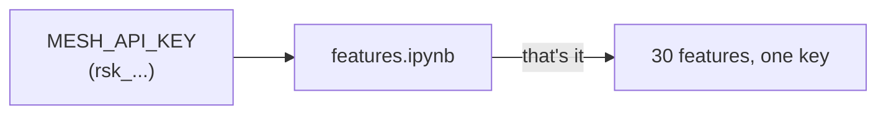
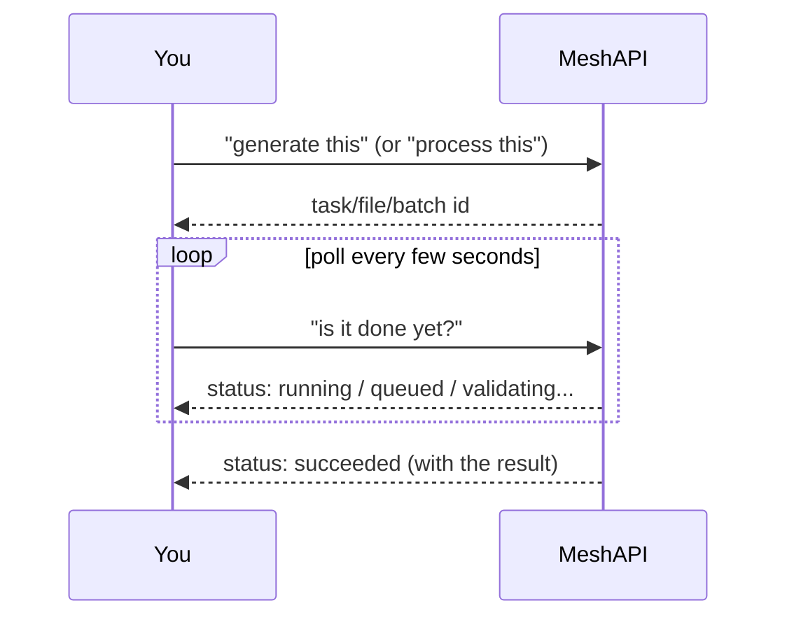
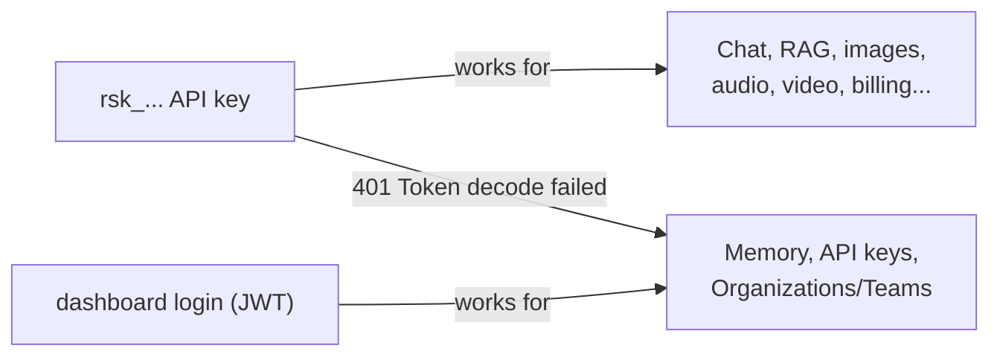
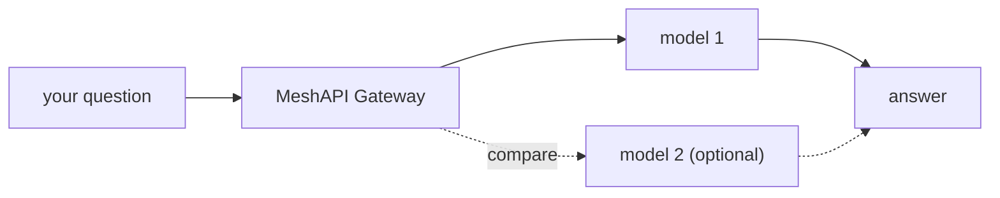
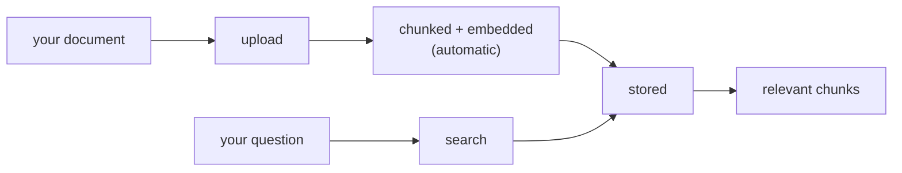
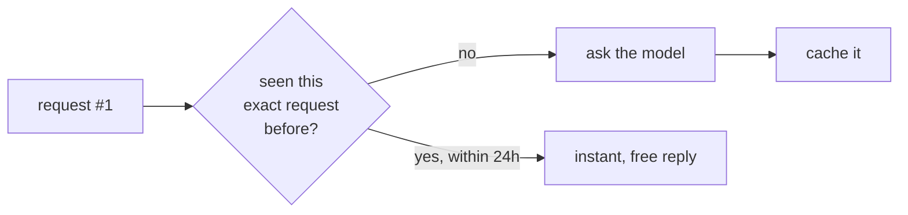

# features.ipynb — What's Inside

A guide to `features.ipynb`, in plain words. That notebook walks through every feature MeshAPI
offers, one at a time, and actually runs each one against a live key. This file explains what each
section does and why it matters, without needing to open Jupyter.

**Recommended order:** `01_meshapi_basics_lazy_imports.ipynb` (client + one chat call, nothing else)
→ `02_rag_multiagent_lazy_imports.ipynb` (RAG + multi-agent, introduces model discovery for real) →
`features.ipynb` / `features_lazy_imports.ipynb` (this one — everything else, no topic repeated
twice). The `_lazy_imports` copies import each SDK class at its first point of use instead of one
big upfront block, and additionally show *how* a model is picked (not just that one is hardcoded)
for embeddings, images, video, TTS, and STT.

---

## Env keys you need

| Variable | Required? | Where it's used |
|---|---|---|
| `MESH_API_KEY` (or `MESHAPI_TOKEN`) | **Yes** | Every single cell in the notebook |
| `MESHAPI_BASE_URL` | No — defaults to `https://api.meshapi.ai` | Same as above |
| Pinecone / Jina keys | **Not needed here** | Only used in `02_rag_multiagent_lazy_imports.ipynb` (original: `experiments/old_experiments/02_rag_multiagent.ipynb`), which builds its own RAG stack. `features.ipynb` uses MeshAPI's own built-in RAG instead, so it doesn't need them. |

The notebook reads `.env` automatically (`load_dotenv()`), or falls back to a `getpass()` prompt if
the key isn't set. One key, every feature — that's the whole point of a gateway.

---

## A couple of ideas that repeat throughout — worth understanding once

**1. Ask now, wait later (async jobs).** Some features don't reply instantly — you kick off a job,
get back an ID, and poll until it's done. Video generation, Batch API, and file upload for RAG all
work this way:

**2. Two kinds of key.** Most of MeshAPI works with the `rsk_...` API key this notebook uses. But
three features — Memory, API key management, and Organizations/Teams — turn out to need a
**dashboard login token** instead (a JWT, the kind you get from logging into a website, not an API
key). The notebook calls them anyway and shows the real error, because that boundary is worth seeing:

---

## Section 1 — Talking to models

The core of the gateway: send messages, get replies.

| Feature | In plain words |
|---|---|
| **Chat Completions** | Send a question, get an answer. The basic building block everything else sits on top of. |
| **Streaming** | Same as above, but the reply prints word-by-word as it's generated instead of all at once. |
| **Tool / Function calling** | The model can ask *you* to run a function (like "check the weather") and use the result before answering. |
| **Structured outputs** | Force the reply into a JSON shape you define (a Pydantic class), instead of free-flowing text. |
| **Compare** | Ask 2+ models the same question in a single call, see both answers side by side. |
| **Model discovery** | Ask the gateway what models actually exist right now, instead of guessing a name that might not exist. |
| **Error handling** | Errors come back as structured objects (`status`, `error_code`) you can branch on in code, not just error text to parse. |
| **Responses API** | A newer alternative to Chat Completions, built for reasoning models and background jobs. |
| **Auto Router** | Set `model: "auto"` and MeshAPI picks a model for you based on your prompt. |

**Cost:** cheap — uses small/fast models throughout.

---

## Section 2 — Retrieval & memory

| Feature | In plain words |
|---|---|
| **Embeddings** | Turns text into a list of numbers (a "vector") that captures its meaning — used for search/similarity. Picking a model for this has a gotcha: filter on the `supports_embeddings` flag, not `model_type == "embedding"` (a different, smaller bucket that doesn't include the model actually used here) — see [`01_research.md` §6.1](01_research.md) for the live-verified details. |
| **Built-in RAG** | Upload a document, MeshAPI chunks it, embeds it, and stores it for you — then you can search it. No separate vector database needed. |
| **Memory** | This is what MeshAPI actually calls a "guardrail" — a rule you save once (e.g. "never give financial advice") that gets automatically included in every future chat call. Not a content-safety filter (that's Moderations, below). |

**Cost:** cheap — embeddings and a tiny 1-sentence document.

---

## Section 3 — Images, video, and audio

| Feature | In plain words |
|---|---|
| **Image generation** | Text prompt → a generated image. |
| **Image editing** | Take an image and remove its background, upscale it, inpaint/outpaint it, etc. |
| **Video generation** | Text prompt → a short generated video clip. Async — you poll until it's ready (took ~30 seconds for a 3-second clip in testing). |
| **Text-to-speech (TTS)** | Text → an audio file of someone speaking it. |
| **Speech-to-text (STT)** | Audio → the text transcript of what was said. |
| **Audio translation** | Audio in one language → text in another. |
| **Realtime speech-to-speech** | A live, two-way voice conversation over a WebSocket — like a phone call with an AI. The notebook only tests that the connection opens (a full voice demo needs a microphone pipeline, which is an app-level project, not a notebook cell). |

**Cost:** real but small — one tiny image, one ~3 second video, a couple sentences of speech. Together, pennies.

---

## Section 4 — Safety

| Feature | In plain words |
|---|---|
| **Moderations** | Checks text (or images) for 13 categories of unsafe content — harassment, violence, self-harm, etc. — each with a yes/no flag and a confidence score. |

---

## Section 5 — Reliability & cost

| Feature | In plain words |
|---|---|
| **Automatic retry & fallback** | If a provider is slow or down, MeshAPI retries, then tries a different provider — automatically, no code changes needed. Response headers show what happened, even when nothing went wrong. |
| **Response caching** | The exact same request (temperature 0) is cached free for 24 hours — the second identical call is instant and free. Confirmed live: same request twice, `X-Cache` header goes from missing to `HIT`. |
| **Batch API** | Submit a bunch of requests as one job, cheaper than real-time, processed within a time window (e.g. 24 hours) instead of instantly. Not every model supports this — check the model's `supports_batching` flag first. |

---

## Section 6 — Prompts & workflow helpers

| Feature | In plain words |
|---|---|
| **Prompt Templates** | Save a reusable system prompt with `{{variables}}` on MeshAPI's servers — your app just says "use template X" instead of resending the whole prompt every time. |
| **Web Search** | A built-in search tool — send a query, get back an AI-written answer plus real source links. |

---

## Section 7 — Accounts, billing & ops

None of these have a Python SDK method — they're plain HTTP calls with the same key.

| Feature | In plain words | Works with `rsk_` key? |
|---|---|---|
| **Balance** | How much credit is left on this key, right now. | ✅ Yes |
| **Usage & rate limits** | Live view of your requests-per-minute/day limits. (Spend-summary specifically needs an `org_id` a personal key doesn't have.) | ✅ Yes (rate limits) / ⚠️ partial (usage summary) |
| **API key management** | Create/limit/suspend keys. | ❌ No — needs a dashboard login |
| **Organizations & Teams** | Company accounts with shared billing and roles. | ❌ No — needs a dashboard login |
| **BYOK (Bring Your Own Key)** | Route through MeshAPI using *your own* OpenAI/Bedrock/Vertex account instead of the shared pool. | Not tested — needs provider credentials set up in the dashboard first; code shown but not run |

---

## Section 8 — Developer tooling

| Feature | In plain words |
|---|---|
| **Python SDK** | The `meshapi` package — what this whole notebook is built on. |
| **Go SDK** | Same ideas, for Go projects instead of Python. Not demoed (wrong language for a Python notebook). |
| **MCP Server** | Lets AI coding tools (Claude Code, Cursor) call MeshAPI directly from your editor's chat. This is IDE configuration, not a Python call — shown as a config snippet, not executed. |
| **CLI (`meshapi-code`)** | A separate terminal app for chatting with models and having them edit your files, similar to Claude Code. Installed and run outside Python — shown, not executed. |

---

## Quick reference: which sections actually spend money

| Free / pennies | Small real cost |
|---|---|
| Chat, streaming, tools, structured output, compare, model discovery, error handling, Responses API, Auto Router, Embeddings, RAG, Memory (attempted), Moderations, retry/fallback headers, caching, Batch (2 tiny requests), Prompt Templates, Web Search, Balance/Usage/rate-limits, key/org boundary checks | Image generation, image editing, video generation, TTS, STT, audio translation |

Everything in the right-hand column is kept to the smallest size/duration possible (1 image, 1 tiny
video, a couple sentences of audio) — real cost, but small change.
