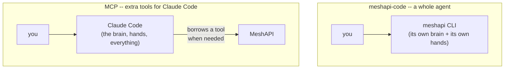
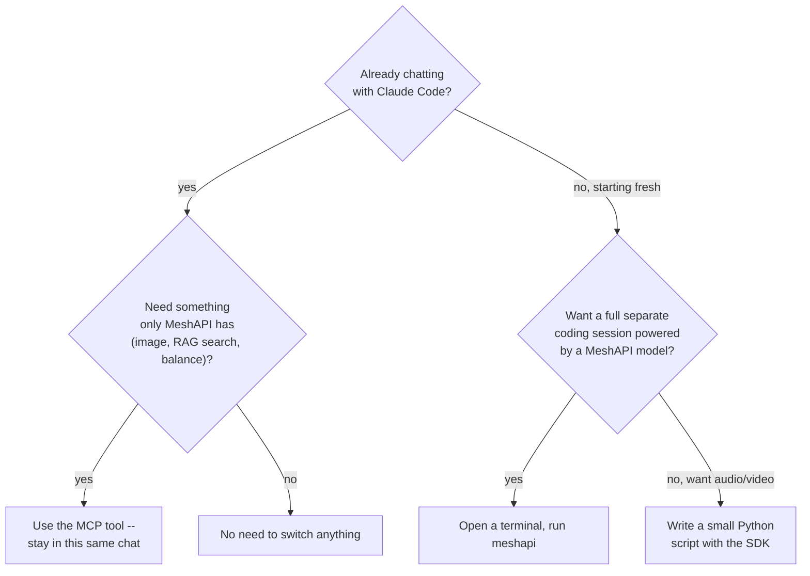
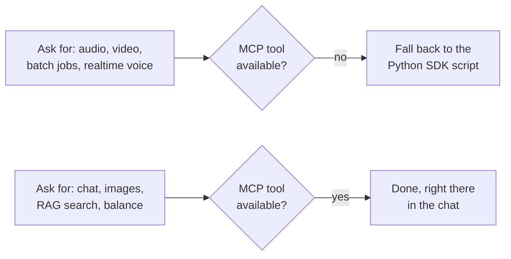

# meshapi-code vs MCP: What Each One Can Do

Two ways to use MeshAPI while coding. They look similar but are actually opposite shapes. This doc
explains both in simple words, then lists exactly what MCP can and can't do — checked live in a real
session, not copied from docs.

## The big picture

- **`meshapi-code`** is a **complete, separate coding agent**. You open it instead of Claude Code. It
  reads your question, edits your files, runs commands — all by itself, powered by whichever MeshAPI
  model you pick.
- **MCP** doesn't replace anything. Claude Code stays the brain. MCP just means Claude Code can now
  say "let me call MeshAPI for this one thing" — like calling in a specialist — and keep going.

They are not competing for the same job. One *is* an agent. The other *gives* an agent extra tools.

## What each one can actually do

| | `meshapi-code` CLI | MCP (inside Claude Code) |
|---|---|---|
| Chat, answer questions | ✅ (that's its whole job) | ✅ via the `chat` tool |
| Read / edit your project files | ✅ built in | ✅ (Claude Code already does this natively — doesn't need MeshAPI for it) |
| Run terminal commands | ✅ built in, with permission modes | ✅ (again, Claude Code already does this) |
| Switch between MeshAPI models | ✅ `/model`, `/models` | ✅ pick a model per `chat`/`compare` call |
| Generate an image | ❌ no such command | ✅ `generate_image` / `edit_image` |
| Search your own uploaded documents (RAG) | ❌ | ✅ `file_search`, `upload_file` |
| Check account balance | ❌ | ✅ `get_balance` |
| Generate audio (text-to-speech) | ❌ | ❌ — **neither** has this |
| Generate video | ❌ | ❌ — **neither** has this |

The last two rows are the important finding: audio and video are missing from *both*. For those you
need the plain Python SDK (a script), not either of these tools. More on that below.

## Which one should you use?

Simple rule of thumb:
- **Already in Claude Code and just need one MeshAPI thing done** (an image, a balance check, a
  search) → let it use the **MCP tool**, no extra step.
- **Want a whole separate session, different model, own permission rules, nothing to do with
  Claude Code** → open a terminal and run **`meshapi`**.
- **Want audio or video** → neither tool does it. Use the SDK directly (a Python script).

## What's confirmed missing from MCP (tried live, not just read about)

- **Audio (text-to-speech / speech-to-text)** — no MCP tool
- **Video generation** — no MCP tool
- **Batch API** — no MCP tool
- **Realtime voice** — no MCP tool

For all four, the working alternative today was the Python SDK (`client.audio.synthesize(...)`,
`client.videos.generate(...)`), run as a script — same MeshAPI key, just called from code instead of
a chat tool.

## Full list of what MCP *does* cover

**Chat & text** — `chat`, `compare` (ask 2+ models at once), `responses` (reasoning models),
`router_select` (preview which model auto-router would pick)

**Images** (tested live, works well) — `generate_image`, `edit_image`

**Your documents (RAG)** — `upload_file`, `list_files`, `get_file`, `file_search`

**Everything else** — `embeddings`, `moderations`, `list_models`, `list_voices`, prompt template
tools (`create_template`/`get_template`/`list_templates`/`update_template`/`delete_template`),
`get_balance` (free to check, confirmed live — returned a real balance of $49.16)

## Real examples from this session

| Ask | Used | Model / voice | Why that pick |
|---|---|---|---|
| Image: student outside Krish Niak University | MCP `generate_image` | `openai/gpt-image-1` | Default, worked first try |
| Video: student jumping outside Krish Niak University | SDK script (no MCP tool exists) | `byteplus/seedance-1-0-pro-fast` | 3-second clip, ready in ~40s |
| Hinglish audio | SDK script (no MCP tool exists) | `sarvam/bulbul:v2`, voice `meera` | Sarvam specializes in Indian languages |
| Plain English audio, natural tone | SDK script (no MCP tool exists) | `elevenlabs/eleven_flash_v2_5`, voice George | Sounds more natural than the English-only Kokoro model |
| Hindi audio | SDK script (no MCP tool exists) | `sarvam/bulbul:v2`, voice `meera` | Same specialist; text written in Devanagari for correct pronunciation |

**Two quirks found doing these, worth knowing:**
- `generate_image` always returns the image as inline base64 text (not a real link), even though you
  can ask for `response_format: "url"` — the raw output was ~2.5MB of text as a result. Had to decode
  it manually into an actual image file.
- The audio file MeshAPI sends back doesn't always match the format its name implies — check the
  actual file (`RIFF...WAVE` = WAV, `ID3` = MP3) before trusting a `.mp3`/`.wav` label. Sarvam
  returns WAV by default; ElevenLabs returns MP3.

## See also

- [`03_cli_and_claude_code.md`](03_cli_and_claude_code.md) — full setup steps for both `meshapi-code`
  and the MCP server (including the `.mcp.json` route that actually worked in this repo), plus the
  complete `/help` command list for the CLI
- [`01_research.md`](01_research.md) — the full MeshAPI feature inventory (32 features total), of
  which this doc covers the "usable through Claude Code, one way or another" slice
