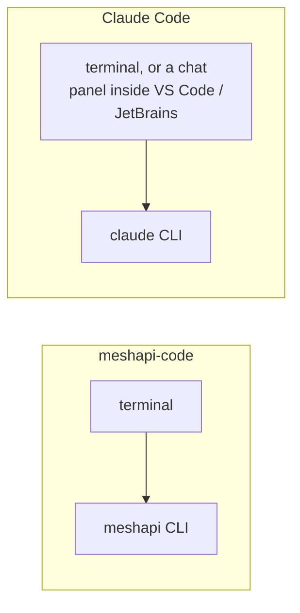
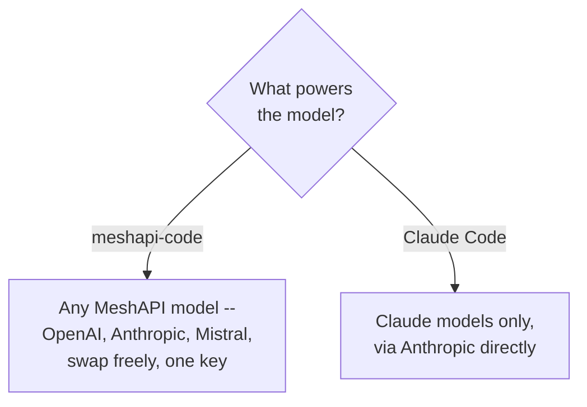
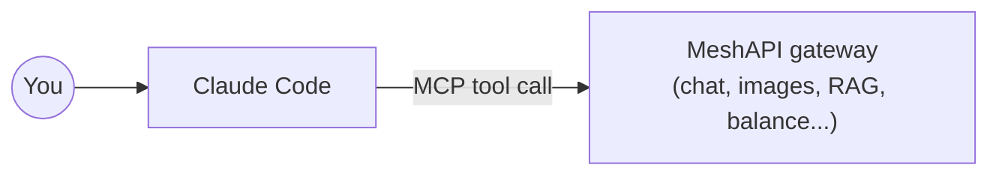

# `meshapi-code` vs Claude Code — as Products

A step back from `04_mcp_capabilities.md` (which compares exact tool-by-tool capabilities): this doc
is about how the two products are actually *built*, since a wrong assumption here caused most of the
confusion in an earlier version of this file.

**Correction first:** Claude Code is **not** a separate desktop GUI application. It's a terminal/CLI
tool — the same kind of thing as `meshapi-code` — that also ships as extensions inside editors you
already use (VS Code, JetBrains). There's no standalone "Claude Code app" with its own window, file
tree, or diff viewer outside of an editor. This very document is being written inside one of those
editor extensions, running in a terminal-shaped chat panel, not a separate app.

## Both are the same shape of thing

Both: run from a terminal (or terminal-like panel), read/edit your files, run shell commands, ask
before doing risky things (permission modes), and chat with you about your code. Neither is a heavier
desktop application than the other.

## Where they actually differ

| | `meshapi-code` | Claude Code |
|---|---|---|
| Who built it | MeshAPI (Fiesta Labs) | Anthropic |
| Which model(s) power it | Any model MeshAPI routes to — swap with `/model` | Claude models, via Anthropic |
| Where it runs | Terminal only | Terminal, or as an extension inside VS Code / JetBrains |
| Extensible with outside tools? | No — it doesn't consume MCP servers itself | Yes — can add MCP servers (like this repo's `mesh-api` one) as extra tools |
| Pricing | Pay MeshAPI per token used, one prepaid balance | Anthropic subscription or API usage |

## The one thing that actually connects them

Claude Code can use MeshAPI **as a tool**, via the MCP server set up in `03_cli_and_claude_code.md`.
That's a one-directional relationship — Claude Code calling out to MeshAPI when it needs something
MeshAPI offers (an image, a balance check). `meshapi-code` has no equivalent way to call *into*
Claude Code; it's a closed, standalone tool.

## Which to use

Simple version: if you're already in Claude Code (like right now) and just need one MeshAPI thing
done, use the MCP tool — no context switch. If you want a completely separate session on a
non-Claude model, open a terminal and run `meshapi`. Full tool-by-tool breakdown, including what
neither one can do (audio, video), is in
**[`04_mcp_capabilities.md`](04_mcp_capabilities.md)**.
