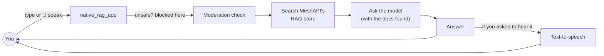
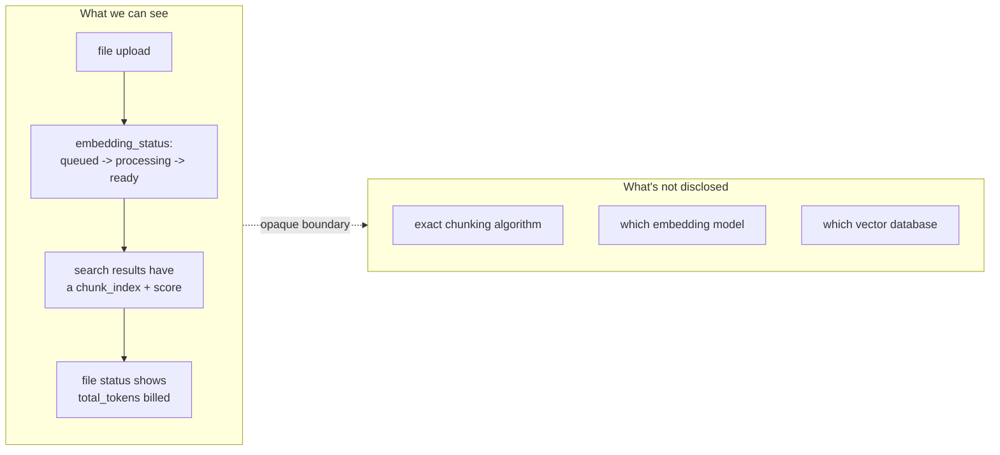
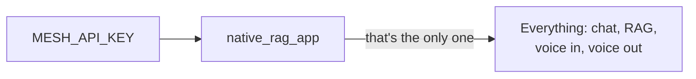
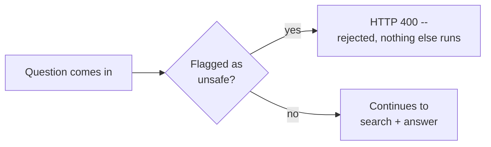

# `native_rag_app` — MeshAPI-Native RAG, With Voice

A guide to the `native_rag_app/` folder, in plain words: what it does, how it's built, what it needs
to run, and proof it actually works (tested live, not just written).

## What it is, in one picture

A support-bot web app for a fictional company ("Nimbus Cloud"). Type or **speak** a question, it
finds the relevant policy doc and answers — and can speak the answer back to you.



The headline feature: **there's no vector database here at all.** MeshAPI stores, chunks, and
searches your documents itself — you just upload and search.

## What actually chunks, embeds, and stores your documents?

Short, honest answer: **MeshAPI does, and it's a black box** — checked their official docs directly
for this, and none of the following is publicly disclosed:

- **Chunking strategy or chunk size** — not published. The docs only say files are "automatically
  convert[ed] into searchable chunks."
- **Which embedding model** — not published. (Different from the standalone `/v1/embeddings`
  endpoint elsewhere in this repo, where *you* pick the model — the managed RAG store's embedding
  step is internal and fixed.)
- **Which vector database** — not published at all; the docs describe the API, not the infrastructure
  behind it.



What **is** observable, from the SDK's response fields and from testing live: each search result
carries a `chunk_index` (so chunking definitely happens), and each uploaded file's status shows
`total_tokens` / `total_cost_usd` once embedded (so token-based billing on an embedding model
definitely happens) — but neither field says which chunk size or which model. One concrete data
point from testing: a single ~1,500-character document came back as **exactly one chunk**, no matter
how many paragraphs it had — so whatever size threshold triggers a split, it's larger than that.

If you need to control chunking strategy yourself (fixed window, semantic splitting, a specific
embedding model, a specific vector DB), that's exactly the tradeoff of using a managed store like
this one — the deleted `app/` (Pinecone) version of this demo was the alternative that gave you that
control, at the cost of writing the chunk/embed/upsert code yourself.

## What's in the folder

| File | What it does |
|---|---|
| `config.py` | Settings from environment variables — only `MESH_API_KEY` is required |
| `data.py` | The sample knowledge base (8 short policy documents) |
| `meshapi_client.py` | Every call to MeshAPI: chat, RAG upload/search, moderation, text-to-speech, speech-to-text |
| `rag.py` | Ties it together: upload docs once, search on each question, build the answer prompt |
| `main.py` | The FastAPI routes (web page + JSON API, including the voice endpoint) |
| `templates/index.html` | The page you see in the browser |
| `static/app.js` | Handles typing, clicking the mic, playing the spoken answer back |
| `static/style.css` | Styling |

## Env keys needed



Just **one** — `MESH_API_KEY` in your `.env`. No second service to sign up for, no vector database
account. A few optional variables let you override defaults if you want a different chat model or
voice — see `.env.example` — but nothing else is required.

## How to run it

```cmd
cd /d D:\meshapi
pip install -r requirements.txt
uvicorn native_rag_app.main:app --reload --port 8001
```

Open `http://127.0.0.1:8001`, click **"Index knowledge base"** once, then type a question or click
🎤 and ask out loud.

Or test the API directly:
```cmd
curl -X POST http://127.0.0.1:8001/api/ingest
curl -X POST http://127.0.0.1:8001/api/ask -H "Content-Type: application/json" -d "{\"question\": \"What happens if I go over my storage limit?\", \"speak\": true}"
```

## The three endpoints

| Endpoint | What it does |
|---|---|
| `POST /api/ingest` | Uploads the 8 sample documents to MeshAPI's RAG store, waits for them to finish embedding |
| `POST /api/ask` | Text question in → answer + sources out. Add `"speak": true` to also get a spoken-audio reply (base64) |
| `POST /api/ask-voice` | Upload a recorded question (audio file) → transcribes it, answers it, always speaks the reply back |

## Security: content moderation

Every question — typed or spoken — is checked against MeshAPI's moderation endpoint **before** it
reaches search or the model:



Tested live: a normal question answers correctly; a clearly unsafe one ("I want to hurt someone...")
comes back `400` immediately, before any search or model call happens (so it doesn't cost anything
either).

## The one gotcha to know about

MeshAPI's RAG file store is **account-wide with no delete option** — every document ever uploaded
with your key stays searchable forever, across every app that ever used that key. Left unhandled,
this means old test uploads (from this app, or `features.ipynb`, or anything else) could show up
mixed into your search results.

**The fix already in `rag.py`:** after `ingest()` uploads documents, it saves their file IDs to a
small local file (`.rag_state.json`, gitignored). Every search is then scoped to just those IDs
(`file_ids=...`), so it only ever searches this app's own documents — not the entire account.

## Confirmed working (tested live)

- **Ingest**: 8/8 documents uploaded and embedded successfully
- **Ask**: a real question ("How much storage do I get on the Pro plan?") came back correctly
  answered, citing the right source document with the top relevance score
- **Voice out** (`speak: true`): returned real, playable audio
- **Moderation**: a normal question passes through; an unsafe one is blocked with `HTTP 400` before
  reaching the model

## Why this design for a demo

One credential, voice is a strong wow-factor, and there's less code to explain than a
chunking/embedding/vector-index pipeline — good reasons this is "the" RAG app going forward, not one
of two options. The tradeoff to know: you don't control chunking strategy, since MeshAPI handles it
server-side (see the gotcha above for the other thing that comes with that).
