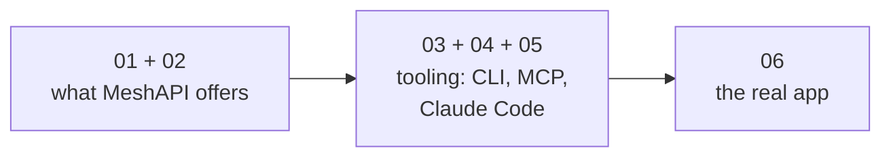

# Documentation

Read these in order — they build from "what MeshAPI offers" up through the
tooling and comparisons.

| # | File | What it covers |
|---|------|----------------|
| 01 | [`01_research.md`](01_research.md) | Plain-language inventory of every MeshAPI feature, verified live against the docs and a real API key. Start here. |
| 02 | [`02_features.md`](02_features.md) | A guided walkthrough of `features.ipynb` — what each notebook section does and why it matters, without opening Jupyter. |
| 03 | [`03_cli_and_claude_code.md`](03_cli_and_claude_code.md) | Two separate integrations: the `meshapi-code` terminal agent, and adding MeshAPI as an MCP tool inside Claude Code. |
| 04 | [`04_mcp_capabilities.md`](04_mcp_capabilities.md) | `meshapi-code` vs the MCP server side by side — what MCP can and can't do (checked live). |
| 05 | [`05_meshapi_vs_claude_code.md`](05_meshapi_vs_claude_code.md) | `meshapi-code` vs Claude Code as products — how each is actually built, not just what commands they have. |
| 06 | [`06_native_rag_app.md`](06_native_rag_app.md) | `native_rag_app/` explained — architecture, env keys, endpoints, the account-wide-RAG-store gotcha and its fix, moderation, and confirmed-live test results. |

There's no tracked changelog file in this repo — session-to-session progress notes are kept locally
and untracked rather than committed.
